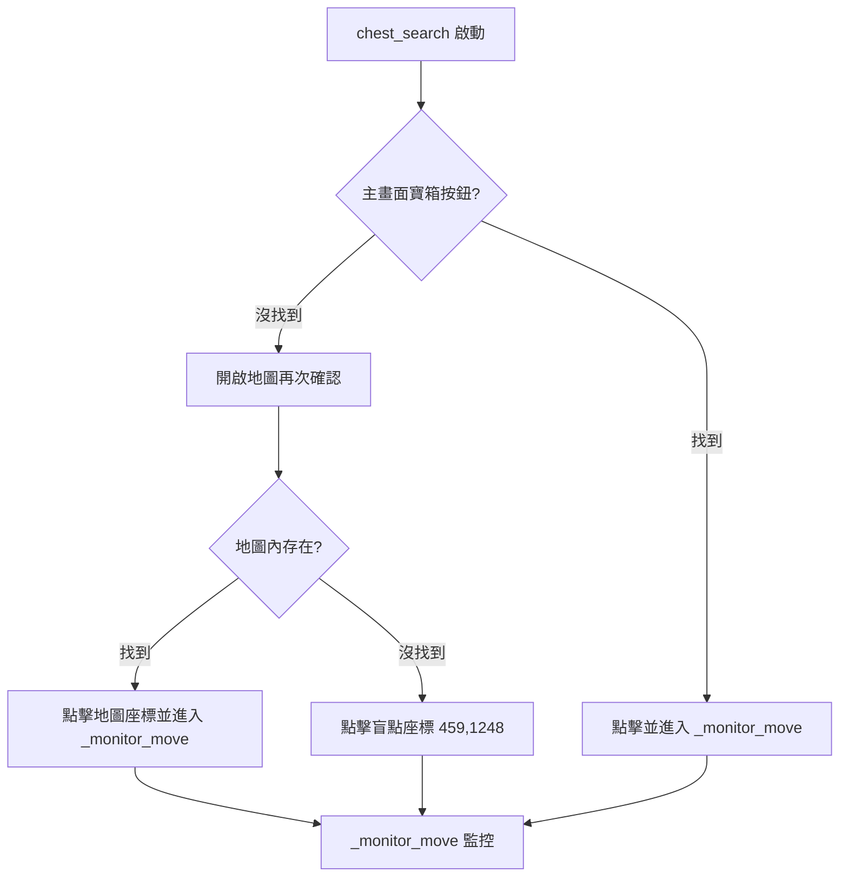

# DungeonMover 架構重構

將所有移動邏輯統一整合到 `DungeonMover` 類別內。

---

## 新架構

| 目標類型 | 移動方法 | 容錯 |
|---------|---------|------|
| 目標類型 | 移動方法 | 完成判定 | 容錯 |
|---------|---------|----------|------|
| **chest_auto** | `chest_search()` | 文字 `notresure` 或 靜止 | `_fallback_gohome()` |
| **chest** | `chest_navigation()` | 文字 `routenotfound` | `_fallback_gohome()` |
| **position** | `resume_navigation()` | 文字 `routenotfound` | `_fallback_gohome()` |
| **harken** | `resume_navigation()` | `_HARKEN_TELEPORT_JUST_COMPLETED` | `_fallback_gohome()` |
| **stair** | `resume_navigation()` | 文字 `routenotfound` 或 圖片變化 | `_fallback_gohome()` |
| **minimap_stair** | `resume_navigation()` | 小地圖 ROI 偵測目標樓層 | `_fallback_gohome()` |

> [!NOTE]
> `routenotfound` 和 `notresure` 是**漸變文字**，需要 **0.5 秒延遲**後才能正確偵測。

---

## chest_search (針對 chest_auto 類型)
*適用於：主畫面直接偵測寶箱按鈕並點擊的模式。*



## chest_navigation (針對 chest 類型)
*適用於：quest.json 定義中包含特定 ROI 地圖點位的寶箱模式。*

1. **流程**：開啟地圖 -> 在指定 ROI 內搜尋 `chest` 圖標 -> 點擊。
2. **失敗處理**：若在 ROI 內找不到圖標，立即 `pop(0)` 並清除導航，返回 `Map` 狀態。
3. **完成判定**：與 `position` 相同，使用 `routenotfound` 判定。

---

---

## resume_navigation

適用目標：**position / harken / stair / minimap_stair**

### 共用流程

```
resume_navigation
    │
    ├─ 1. Resume 優化（條件：已完成防轉圈 AND 非重啟後待開地圖 AND 已遇過戰鬥/寶箱）
    │   ├─ 偵測 Resume 按鈕（最多 3 次重試，每次間隔 0.5s）
    │   │   ├─ 找到 Resume → 點擊
    │   │   │   └─ 直接進入 _monitor_move（Resume 按鈕點擊後不會消失，無需驗證）
    │   │   └─ 找不到 Resume → 繼續重試或進入標準流程
    │   └─ 3 次重試後仍未找到 → 執行標準導航流程
    │
    ├─ 2. 標準導航流程（首次進入或 Resume 優化失敗）
    │   ├─ 開地圖 [777,150]
    │   ├─ 等待地圖開啟（檢測 mapFlag）
    │   │   └─ 失敗保護：連續 3 次失敗 → _fallback_gohome()
    │   └─ 搜索並點擊目標座標
    │
    ├─ 3. 進入 _monitor_move
    │   ├─ 狀態轉換（戰鬥/寶箱）→ return 給 StateDungeon 處理
    │   ├─ 檢測到 `visibilityistoopoor` → 點擊 Resume (嘗試脫困)
    │   ├─ 【依目標類型執行完成檢測】
    │   ├─ Keep-Alive：每 3 秒定期檢查並點擊 Resume（適用於 position/stair）
    │   └─ 靜止判定 → _fallback_gohome()（防卡死）
    │
    └─ 4. 主流程整合：戰鬥/寶箱後 StateDungeon 再次呼叫 → 回到 Step 1（Resume 優化）
```

> [!IMPORTANT]
> **Resume 按鈕行為特性：**
> - Resume 按鈕在地城移動時會**持續顯示**（不會因點擊而消失）
> - 點擊 Resume 後，角色會恢復中斷的自動尋路
> - **錯誤做法**：~~檢查點擊後 Resume 是否消失來判斷成功~~（永遠失敗）
> - **正確做法**：點擊後直接進入監控循環，由監控循環判斷移動/到達狀態

---

### 目標類型差異

#### position

| 項目 | 說明 |
|-----|------|
| 完成偵測 | `routenotfound` 文字 |
| Keep-Alive | 每 5 秒點擊 resume |
| 特殊處理 | 無 |

#### harken

| 項目 | 說明 |
|-----|------|
| 完成偵測 | `_HARKEN_TELEPORT_JUST_COMPLETED` flag + `dungFlag` 可見 |
| 樓層選擇 | `IdentifyState` 偵測到 `floorImage` 後點擊 |
| 傳送判定 | 點擊樓層 → 黑畫面 → `dungFlag` 再次可見 = 完成 |
| Keep-Alive | 無（傳送中不需要） |

> [!NOTE]
> **harken 傳送完成判定原理：**
> 1. 點擊樓層 → 設置 `_HARKEN_TELEPORT_JUST_COMPLETED = True`
> 2. 傳送黑畫面 → `dungFlag` 不可見 → 不觸發完成
> 3. 黑畫面結束 → `dungFlag` 可見 → 觸發完成 → pop

#### stair

| 項目 | 說明 |
|-----|------|
| 完成偵測 | `routenotfound` 文字 或 圖片消失/出現 |
| Keep-Alive | 每 5 秒點擊 resume |
| 雙重判定模式 | 1. **Pass 型** (up/down/teleport): 圖標消失 = 通過<br>2. **Arrival 型** (floorName): 新圖標出現 = 到達 |

> [!NOTE]
> **stair 類型的彈性判定：**
> - 當目標名包含 `up/down/teleport` 時，腳本會在地圖上持續監控該樓梯圖標，一旦圖標消失，視為角色已走入樓梯並完成 `pop`。
> - 這補足了部分樓梯位置可能不會觸發 `routenotfound` 的問題。

#### minimap_stair

| 項目 | 說明 |
|-----|------|
| 完成偵測 | 小地圖 ROI `[651,24,870,244]` 內樓層圖片出現 |
| Flag | `_MINIMAP_STAIR_IN_PROGRESS`, `_MINIMAP_STAIR_FLOOR_TARGET` |
| 開地圖 | ❌ 不需要（適用打不開地圖的地形）|

> [!NOTE]
> **minimap_stair vs stair：**
> - **stair** - 需開地圖檢查，區分 up/down/teleport，舊 quest.json 用
> - **minimap_stair** - 不需開地圖，只檢測新樓層圖片，新地形用

---

## _fallback_gohome

**觸發條件：**
- chest_search/resume_navigation 靜止時檢測到 mapFlag（防卡死）
- 軟超時 (60s)

```
_fallback_gohome
    │
    ├─ 1. 找 gohome 按鈕
    │   ├─ 主畫面找到 → 點擊
    │   └─ 找不到 → 打開地圖 → 再找 → 盲點座標 [252,1433]
    │
    ├─ 2. 進入 _monitor_move (is_gohome_mode=True)
    │   ├─ 每 3 秒持續點擊 gohome (Keep-Alive)
    │   └─ 偵測離開地城：worldmapflag 或 Inn
    │
    └─ 3. 離開地城
        └─ return DungeonState.Quit
```

**超時保護：** 硬超時 (90s) → 觸發 restartGame()

> [!NOTE]
> **地城離開的兩種情況：**
> - **世界地圖地城**：gohome 後進入世界地圖 → `IdentifyState` 處理城池點擊（Deepsnow/RoyalCityLuknalia/fortressworldmap）
> - **城內地城**：gohome 後進入城內地圖 → EOT 序列處理 `returntotown` 返回村內

---

## 地圖開啟失敗保護機制

**觸發條件：** 連續 3 次無法打開地圖

```
地圖開啟流程
    │
    ├─ 1. 嘗試打開地圖 Press([777, 150])
    │
    ├─ 2. 檢查是否成功開啟 (mapFlag)
    │   ├─ 成功 → 重置計數器 → 繼續移動
    │   └─ 失敗 → 進入異常判定
    │
    ├─ 3. 異常判定
    │   ├─ 黑屏檢測 (avg_brightness < 30)
    │   │   └─ 是黑屏 → 等待 2 秒 → 重新檢測戰鬥/寶箱
    │   │       ├─ 確認進入戰鬥/寶箱 → 重置計數器 → return 狀態
    │   │       └─ 仍非戰鬥/寶箱 → 繼續判定失敗
    │   │
    │   └─ 非黑屏 → 記錄失敗 → consecutive_map_open_failures++
    │
    └─ 4. 失敗處理
        ├─ failures < 3 → 檢查 visibilityistoopoor → 返回 Dungeon 重試
        └─ failures >= 3 → 觸發 restartGame()
```

### 計數器重置條件

| 條件 | 說明 |
|------|------|
| 點擊 Resume 按鈕後進入監控 | 視為移動已成功恢復（按鈕本身不消失） |
| 黑屏後確認進入戰鬥/寶箱 | 非地圖開啟失敗，而是正常遊戲狀態轉換 |
| 地圖目標搜索成功 | 確認地圖已正常開啟並可操作 |
| 觸發重啟後 | 避免重複觸發 |

---

## _monitor_move 內部邏輯優先級 (Execution Order)

監控循環每秒執行一次，內部邏輯嚴格遵循以下優先級（Priority）：

1.  **狀態打斷 (State Interrupt)**：
    *   優先偵測是否進入戰鬥 (`Combat`) 或寶箱 (`Chest`)。
    *   一旦發現，立即返回狀態碼，交由 `StateDungeon` 處理。
2.  **異常處理 (Abnormal Handling)**：
    *   偵測能見度問題 (`visibilityistoopoor`) -> 點擊 Resume。
    *   檢測 `waiting_for_arrival_after_resume` 臨時引導狀態。
3.  **完成檢測 (Arrival Detection)**：
    *   偵測 `routenotfound` 或各類型的專屬完成條件（如樓梯消失、傳送完成）。
4.  **維持移動 (Keep-Alive)**：
    *   根據計時器執行每 3~5 秒一次的 Resume 點擊。
5.  **卡死判定 (Stillness Check)**：
    *   計算畫面差異 (`diff < 0.05`)。
    *   累積達標後觸發 `_fallback_gohome` 或打開地圖重選路點。

> [!IMPORTANT]
> **為什麼優先級重要？**
> 防止在中斷狀態（如戰鬥中）誤觸發「靜止判定」或「到達偵測」，確保導航進度只在安全的移動狀態下變動。

---

---

## 目標列表 (targetInfoList) 的管理規範

為了確保移動進度被正確保留，必須遵守以下管理原則：

### 1. 生命週期管理
- **初始化**：僅在 `DungeonFarm` 主循環中，首次進入地城（`targetInfoList is None`）或明確開啟新地城時，從 Quest 模板 `copy()` 負荷。
- **持久化**：在地城運行的整個生命週期內（包含 Combat/Chest 狀態切換），**嚴禁**在主循環內重新載入或重置該列表。
- **清空**：僅在回到村莊（`State.Inn`）或完全結束任務時，將變數設為 `None`。

### 2. 進度追踪規範 (pop 邏輯)
- 所有目標完成後執行 `targetInfoList.pop(0)`。
- **強制要求**：隨後必須加上日誌顯示剩餘目標數（例如 `logger.info(f"[DungeonMover] 已移除已完成目標 {target}, 剩餘目標數: {len(targetInfoList)}")`）。這對於除錯「為何地城不會結束」至關重要。

### 3. 為空時的行為
當目標列表為空（`targetInfoList == []`）：
- `DungeonMover.initiate_move` 必須主動觸發 `_fallback_gohome` 流程。
- **目的**：確保角色主動離開地中。若僅返回 `Map` 狀態，會導致主循環重新識別地城並再次載入完整任務目標，形成無限循環。

### 4. 目標切換後的 Resume 屏蔽 (重要)
為了防止新目標啟動時錯誤執行「上一個目標」的 Resume 路徑：
- **觸發點**：在任何 `pop(0)` 操作發生後，立即設置 `_RESTART_OPEN_MAP_PENDING = True`。
- **行為**：此標記會強制下一個目標**跳過 Resume 優化**，必須走「打開地圖 -> 點擊新座標」的標準流程。
- **重置點**：只有在 `resume_navigation` 中**成功於地圖上點擊了新目標**後，才將標記設回 `False`。
- **目的**：確保每個新目標的「第一次導航」都是準確的地圖點擊，而非無效的舊路徑恢復。

---

## 異常狀況預先檢查 (Pre-move Safety Checks)

在 `initiate_move` 啟動任何導航（Resume 或開地圖）前，會執行預檢以排除干擾：
1. **網路/異常彈窗**：檢測 `TryPressRetry`。
2. **對話框卡住**：檢測並點擊 `returnText`。
3. **特定任務選項**：檢測 `_SPECIALDIALOGOPTION` 並嘗試點擊以清除阻礙。

這些檢查能有效防止因遊戲隨機對話框導致地圖打不開，進而觸發誤判重啟。

---

## ⚠️ 架構變更記錄

### `DungeonMover` vs `IdentifyState` 的權威性
- **問題**：原設計依賴 `IdentifyState` 進行所有狀態判定。但在地城中，`DungeonMover` 的戰鬥偵測（基於特定 UI 模板）比 `IdentifyState` 更靈敏。這導致 `DungeonMover` 看到戰鬥 -> 交給 `IdentifyState` -> `IdentifyState` 沒看到 -> 跳回移動邏輯 -> 無限循環。
- **修正**：賦予 `DungeonMover` 在地城環境下的**狀態Override權限**。當 `_check_combat_or_chest` 偵測到戰鬥或寶箱時，**直接返回** `DungeonState.Combat` 或 `DungeonState.Chest`，不再經過 `IdentifyState` 確認。這是為了避免多重權威衝突導致的死循環。

---

## Proposed Changes

### [MODIFY] [script.py](file:///d:/Project/wvd/src/script.py)

**1. 重新命名函數**

| 現有 | 新 |
|-----|---|
| `_start_chest_auto` | `chest_search` |
| `_start_normal_move` | `resume_navigation` |
| `_start_gohome` | `_fallback_gohome` |

**2. 遷移 StateDungeon Resume 邏輯 (L4523-4710) 到 resume_navigation**

**3. 簡化 StateDungeon**：只負責狀態分發

---

## Verification Plan

1. **chest_auto**：正常移動、靜止 pop、被中斷後恢復
2. **position/harken/stair/minimap_stair**：首次開地圖、有 Resume 繼續、無 Resume 重新開地圖、被中斷後恢復
3. **gohome**：觸發條件、持續執行、離開地城
