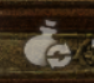

要修改請下載德德的原始代碼後自己設定環境後自行編譯
# 請先自行安裝python環境以及IDE(VS code或者PyCharm之類)
# 修改自德德版本的分支
提供自行修改範例代碼
### 1. 不打斷自動戰鬥(def IdentifyState():)
<pre>
	        Press([1, 1])
            Sleep(0.25)
            Press([1, 1])
            Sleep(0.25)
            Press([1, 1])
            Sleep(1)
			# 移除原始代碼 counter += 1 上面的點擊行為
            counter += 1
</pre>

<pre>
	        if counter>=4:
			logger.info("看起来遇到了一些不太寻常的情况...")
			# 在 if counter>=4: 將上面移除的部分複製過來，需要對齊
            Press([1, 1])
            Sleep(0.25)
            Press([1, 1])
            Sleep(0.25)
            Press([1, 1])
            Sleep(1)
</pre>

### 2. 旅館自動補給(def StateInn():)
<pre> 
	        if not setting._ACTIVE_ROYALSUITE_REST:
			# 增加下面這一段，圖片需要額外手動添加Inn，box，refill至原始碼文件下的resoure/image資料夾下
            FindCoordsOrElseExecuteFallbackAndWait('refilled', ['Inn', 'box', 'refill', 'OK', [1, 1]], 2)
            FindCoordsOrElseExecuteFallbackAndWait('OK',['Inn','Stay','Economy',[1,1]],2)
        else:
			# 增加下面這一段，圖片需要額外手動添加Inn，box，refill至原始碼文件下的resoure/image資料夾下
            FindCoordsOrElseExecuteFallbackAndWait('refilled', ['Inn', 'box', 'refill', 'OK', [1, 1]], 2)
            FindCoordsOrElseExecuteFallbackAndWait('OK',['Inn','Stay','royalsuite',[1,1]],2)
        FindCoordsOrElseExecuteFallbackAndWait('Stay',['OK',[299,1464]],2)
		PressReturn()
 </pre>
# 圖片介紹
這是box圖連結  
  
這是refill圖連結  
  
這是Inn圖連結  

# 打包bat
德德的是簡體會有編碼問題，會跑不了，可以抓取我修改過後的localpack.bat來替換原本的德德的打包bat
