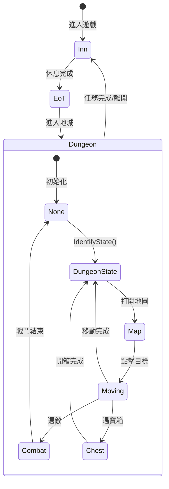
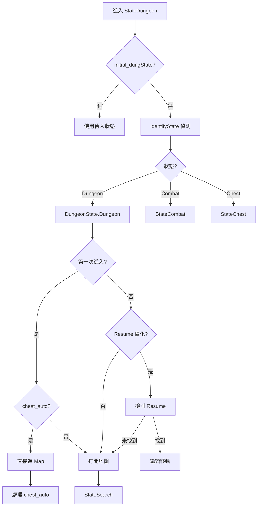

# 地城邏輯完整解析

## 整體架構

---

## 1. 地城狀態機 (DungeonState)

| 狀態 | 描述 | 觸發條件 |
|------|------|----------|
| `None` | 未知狀態 | 需要調用 `IdentifyState()` 確認 |
| `Dungeon` | 地城內閒置 | 偵測到 `dungFlag` |
| `Map` | 地圖已打開 | 偵測到 `mapFlag` |
| `Combat` | 戰鬥中 | 偵測到 `combatActive` 系列 |
| `Chest` | 寶箱開啟中 | 偵測到 `chestFlag` 或 `whowillopenit` |
| `Quit` | 退出地城 | 回到 Inn 或手動停止 |

---

## 2. 目標類型 (TargetInfo)

### 2.1 chest_auto（自動尋寶）

**功能**：使用遊戲內建的自動尋寶按鈕，自動前往收集所有寶箱

**流程**：
1. 進入 `DungeonState.Map` 時檢查目標是否為 `chest_auto`
2. 嘗試偵測 `chest_auto` 按鈕（地圖右上角區域 `[[710,250,180,180]]`）
3. 若找不到，先打開地圖面板（點擊 `mapFlag`），再重新偵測
4. 點擊 `chest_auto` 按鈕觸發自動移動
5. **等待循環**：每 3 秒檢查一次
   - 若 `dungState != DungeonState.Dungeon`（遇到戰鬥/寶箱）→ break，處理後回來繼續
   - 若畫面變化 `mean_diff < 0.05` → 判定尋寶完成，pop 目標

**中斷處理**：
- ✅ 遇到戰鬥/寶箱：**不會 pop**，處理完後回到 chest_auto 繼續
- ✅ 畫面長時間不動（約 6 秒）：判定完成，pop 目標
- ⚠️ 超時 60 秒無變化：觸發 `restartGame()`

### 2.2 position（座標定位）

**功能**：前往地圖上的指定座標

**流程**：
1. 在 `StateSearch` 中調用 `StateMap_FindSwipeClick`
2. 根據 `swipeDir` 滑動地圖找到目標位置
3. 使用 `CheckIf_ReachPosition` 確認游標位置
4. 點擊目標 → 點擊自動移動按鈕 `[138,1432]`
5. 進入 `StateMoving_CheckFrozen()` 監控移動

**Pop 條件**：
- `searchResult == None`（到達目的地，地圖上找不到目標）
- 移動完成且狀態為 `None`/`Map`/`Dungeon`（非戰鬥/寶箱）

**中斷處理**：
- ✅ 遇到戰鬥/寶箱：**保留目標**，處理完後繼續前往

### 2.3 harken（哈肯傳送）

**功能**：使用哈肯石傳送到指定樓層

**流程**：
1. 設置 `runtimeContext._HARKEN_FLOOR_TARGET`
2. 點擊 harken 位置，觸發傳送
3. `IdentifyState` 監控樓層選擇界面
4. 出現目標樓層按鈕時自動點擊
5. 傳送完成後清除 flag

**Pop 條件**：
- 移動完成且狀態為 `None`/`Map`/`Dungeon`

### 2.4 minimap_stair（小地圖樓梯偵測）

**功能**：一邊移動一邊監控小地圖，直到出現指定樓層標識

**流程**：
1. 設置 `runtimeContext._MINIMAP_STAIR_FLOOR_TARGET` 和 `_MINIMAP_STAIR_IN_PROGRESS`
2. 點擊目標開始移動
3. `StateMoving_CheckFrozen` 持續監控小地圖
4. 偵測到樓層標識時清除 flag

### 2.5 stair_xxx（樓梯系列）

**功能**：前往並使用樓梯（上樓/下樓/傳送）

**類型**：`stair_up`, `stair_down`, `stair_teleport` 等

**流程**：與 position 類似，但使用 `CheckIf_throughStair` 進行偵測

---

## 3. 戰鬥邏輯 (StateCombat)

### 3.1 AE 手機制

**條件**：設定了 `_AE_CASTER_1_SKILL` 且符合間隔條件

| 戰次 | AOE 技能設定 | 單體技能設定 | 未設定 |
|------|-------------|-------------|--------|
| 第 1 戰 | 使用普攻 | 使用設定技能 | 使用優先順序單體 |
| 第 2 戰 | 使用 AOE | 使用設定技能 | 使用優先順序單體 |
| 第 3 戰+ | 開啟自動戰鬥 | 開啟自動戰鬥 | 開啟自動戰鬥 |

**優先順序單體技能**（`useForcedPhysicalSkill`）：
1. 地裂斬 (splitEarth)
2. 強力射擊 (powerShot)
3. 十字斬 (crossSlash)
4. 二刀流 (twinsword)
5. 普攻 (attack)

### 3.2 flee 偵測

**機制**：所有戰鬥動作必須等待 `flee` 按鈕出現才執行

- 最多等待 30 次（每次 0.5 秒，共 15 秒）
- 等待超時則跳過本次行動

### 3.3 黑屏偵測

**條件**：
- 已確認進入地城（`_DUNGEON_CONFIRMED`）
- AOE 尚未觸發（`!_AOE_TRIGGERED_THIS_DUNGEON`）
- 行動計數為 0（戰鬥剛開始）
- **僅限前兩戰**（`_COMBAT_BATTLE_COUNT < 2`）

**功能**：偵測到黑屏時持續點擊打斷自動戰鬥，確保 AE 手邏輯生效

### 3.4 技能施放流程

1. 等待 flee 出現
2. 檢查並啟用 2 倍速
3. 根據 AE 手機制或技能序列施放技能
4. 若無可用技能，嘗試開啟系統自動戰鬥
5. 若仍無法處理，點擊空白處

---

## 4. 寶箱邏輯 (StateChest)

### 4.1 開箱流程

1. 等待 `whowillopenit`（誰來開箱）界面
2. 選擇角色（優先使用設定角色，否則隨機）
3. 若角色有恐懼狀態，從候選列表移除
4. 點擊選中角色 → 執行解除陷阱
5. 等待 `chestOpening` → 完成開箱

### 4.2 智能解除 (SmartDisarmChest)

- 若啟用：調用 `ChestOpen()` 智能處理
- 若未啟用：連續點擊 8 次解除按鈕

---

## 5. 移動監控 (StateMoving_CheckFrozen)

### 5.1 核心機制

**輪詢參數**：
- 輪詢間隔：0.3 秒
- 連續靜止要求：33 次（約 10 秒）
- 移動超時：60 秒

**判定停止條件**：
- `mean_diff < 0.1` 且連續 33 次

### 5.2 Resume 優化

當偵測到 Resume 按鈕時：
1. 點擊 Resume 繼續之前的路徑
2. 檢查 `routenotfound` 判斷是否已到達
3. 畫面變化則繼續監控移動

---

## 6. 異常處理

### 6.1 遊戲重啟 (restartGame)

**觸發條件**：
- 畫面卡死（連續多次相同畫面）
- 寶箱用時過久（> 400 秒）
- 戰鬥用時過久（> 400 秒）
- chest_auto 移動超時（> 60 秒）

**重啟後處理**：
1. 重置各種 flag（`_COMBATSPD`, `_STEPAFTERRESTART` 等）
2. 重啟遊戲
3. 進入地城後執行防轉圈：前後左右平移一步

### 6.2 能見度太低 (visibliityistoopoor)

- 無法打開地圖時觸發
- 執行 `gohome` 回城

### 6.3 回城邏輯 (gohome)

- 設置 `_GOHOME_IN_PROGRESS` flag
- 持續點擊 gohome 按鈕
- 途中遇到戰鬥/寶箱則先處理

---

## 7. 進入地城流程

---

## 8. 關鍵 Runtime Context 變數

| 變數 | 類型 | 用途 |
|------|------|------|
| `_FIRST_DUNGEON_ENTRY` | bool | 第一次進入地城標記 |
| `_STEPAFTERRESTART` | bool | 重啟後已執行防轉圈 |
| `_GOHOME_IN_PROGRESS` | bool | 正在回城中 |
| `_COMBAT_BATTLE_COUNT` | int | 當前地城戰鬥次數 |
| `_COMBAT_ACTION_COUNT` | int | 當前戰鬥行動次數 |
| `_AOE_TRIGGERED_THIS_DUNGEON` | bool | 本次地城已觸發 AOE |
| `_HARKEN_FLOOR_TARGET` | str | 哈肯目標樓層 |
| `_MINIMAP_STAIR_IN_PROGRESS` | bool | 小地圖監控中 |
| `_DUNGEON_CONFIRMED` | bool | 已確認進入地城 |
