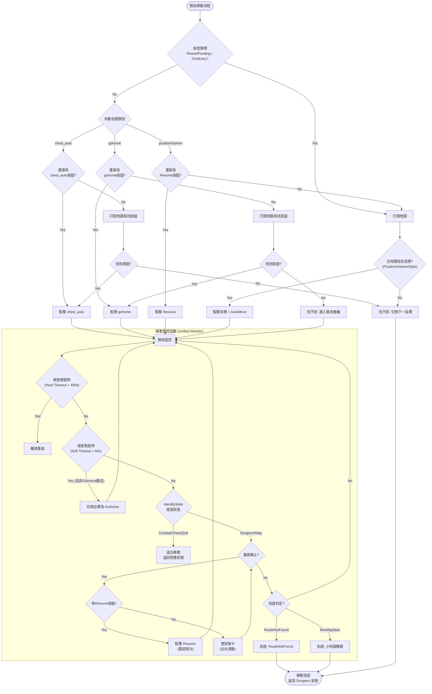

# 重構地城移動邏輯

## 目標描述
重構 `script.py` 中的地城移動邏輯，將 `chest_auto`、`position`、`harken`、**`gohome`** 和 `resume` 的處理邏輯統一。
目前的邏輯中，`chest_auto` 在 `StateDungeon` 中有獨立的處理區塊，而其他移動目標則使用 `StateSearch` 和 `StateMoving_CheckFrozen`。
本計畫旨在將這些整合為一個統一的移動管理器，一致地處理移動的啟動、監控和恢復（Resume/重啟）。

## 需要使用者審查
> [!IMPORTANT]
> 此次重構將大幅修改 `StateDungeon`、`StateSearch` 和 `StateMoving_CheckFrozen`。核心移動決策邏輯將被集中化。
> **分層超時機制**：
> 1. **軟超時 (Soft Timeout, ~60s)**: 判定為移動卡住，觸發 `gohome` 嘗試撤離。
> 2. **硬超時 (Hard Timeout, ~400s)**: 判定為系統嚴重卡死（轉圈/無回應），觸發 `restartGame`。

## 邏輯流程圖 (Mermaid)

## 建議變更詳情

### 1. 集中移動邏輯 (`DungeonMover`)
建立一個新的類別或模組來封裝移動邏輯，包含以下功能：

#### A. 啟動移動 (`initiate_move`)
- **`chest_auto` (自動寶箱)**:
    - 嘗試在主畫面尋找 `chest_auto` 按鈕。
    - 若找不到，打開地圖面板尋找。
    - 點擊後進入監控循環。
- **`gohome` (自動撤離)**:
    - **作為主動目標**: 當 `target` 設定為 `gohome` 時使用。
    - **尋找按鈕**: 在主畫面或地圖面板尋找 `gohome` 按鈕。
    - **行為**: 點擊後進入監控循環。`gohome` 可能會涉及跨樓層移動（自動尋找最近出口），需在監控中持續保持警覺。
- **`position` / `harken` / `stair` (定點移動)**:
    - 確保地圖已開啟。
    - 執行 `StateMap_FindSwipeClick` 尋找並點擊目標。
    - 點擊 `automove` 確認移動。
    - 進入監控循環。

#### B. 監控移動 (`monitor_move`)
這是一個統一的 `while` 循環，取代原本分散在 `StateMoving_CheckFrozen` 和 `StateDungeon` (chest_auto區塊) 的邏輯。

1.  **分層超時管理 (Tiered Timeout)**:
    - **監控依據**: 雖然無法直接偵測轉圈，但「持續移動時間過長」是判斷異常的可靠指標。
    - **Soft Timeout (軟超時 - 建議 60s)**:
        - 定義: 單次移動指令執行超過 60 秒。
        - 判定: 遊戲可能只是卡路徑，或者畫面靜止但 Resume 無效。
        - 行為: **切換目標為 `gohome`**。這不重啟遊戲，而是嘗試最後的撤離手段。
    - **Hard Timeout (硬超時 - 建議 400s)**:
        - 定義: 總地城時間或總移動時間超過 400 秒。
        - 判定: 即使切換到 `gohome` 也無法解決，視為系統層級卡死（轉圈/失控）。
        - 行為: **拋出異常觸發 `restartGame`**。

2.  **狀態檢查 (`IdentifyState`)**:
    - 定期截圖並檢查是否進入 **戰鬥 (Combat)**、**寶箱 (Chest)** 或 **退出 (Quit)** 狀態。
    - 若偵測到上述狀態，暫停或終止移動，返回對應狀態。**重置 Soft Timeout 計時器**。

3.  **靜止與卡死偵測**:
    - **畫面比對**: 比較前後幀的像素差異。
    - **連續靜止**: 若畫面連續 N 秒無變化，判定為靜止。
    - **解卡機制**: 靜止時嘗試左右微幅滑動 (Swipe)，若仍無效則視為移動結束或卡死。

4.  **Resume (恢復) 處理**:
    - 在移動過程中持續偵測 `resume` 按鈕。
    - **觸發條件**: 畫面靜止且出現 `resume` 按鈕。
    - **重試邏輯**: 嘗試點擊 `resume` 最多 5 次。
    - **Fallback**: 若多次點擊無效，**不再直接打開地圖**，而是讓循環繼續跑，直到觸發 Soft Timeout 轉為 `gohome`，或者由到達判定（RouteNotFound）處理。這能避免頻繁開關地圖的無效操作。

5.  **GoHome 特殊邏輯**:
    - **Keep-Alive**: 若移動過程中 `gohome` 按鈕消失（代表移動中）又出現（代表暫停），應再次點擊。
    - **Fallback**: 若 `gohome` 作為 Fallback 被觸發，則應持續執行直到離開地城或進入其他狀態。

### 2. 重構 `StateDungeon` 流程
更新主循環邏輯，使其更清晰地處理狀態轉換：

- **移除** `case DungeonState.Map` 中龐大的 `if/else` 判斷。
- **新增** `DungeonMover` 的呼叫接口。
- **Fallback 機制**: 當一般移動 (`position` 等) 失敗或超時，且無法恢復時，將目標自動切換為 `gohome` 並重新呼叫 `DungeonMover`。

#### 重啟與初始化判斷邏輯
1.  **重啟後 (`_RESTART_OPEN_MAP_PENDING`)**: 跳過 Resume，直接打開地圖。
2.  **首次進入地城 (`_FIRST_DUNGEON_ENTRY`)**:
    - 目標 `chest_auto` / `gohome`: 直接嘗試尋找按鈕。
    - 目標 `position` 等: 強制打開地圖。
3.  **一般狀態 (非重啟/非首次)**: 優先檢查 Resume，無 Resume 則依目標類型行動。

## 驗證計畫
### 自動化測試
*   程式碼語法檢查。

### 手動驗證
*   **場景 1 - 一般移動**: 測試 `position` 目標在 60s 內完成。
*   **場景 2 - 軟超時**: 模擬移動超過 60s，確認目標自動切換為 `gohome` 並開始撤離。
*   **場景 3 - 硬超時**: 模擬 `gohome` 也卡住，總時間超過設定值 (400s)，人為觸發重啟。
*   **場景 4 - 正常 Resume**: 模擬移動中出現 Resume 按鈕，確認能點擊並繼續移動，且不會誤觸超時（如果設計為 Resume 成功重置計時器，或者計時器夠長）。
