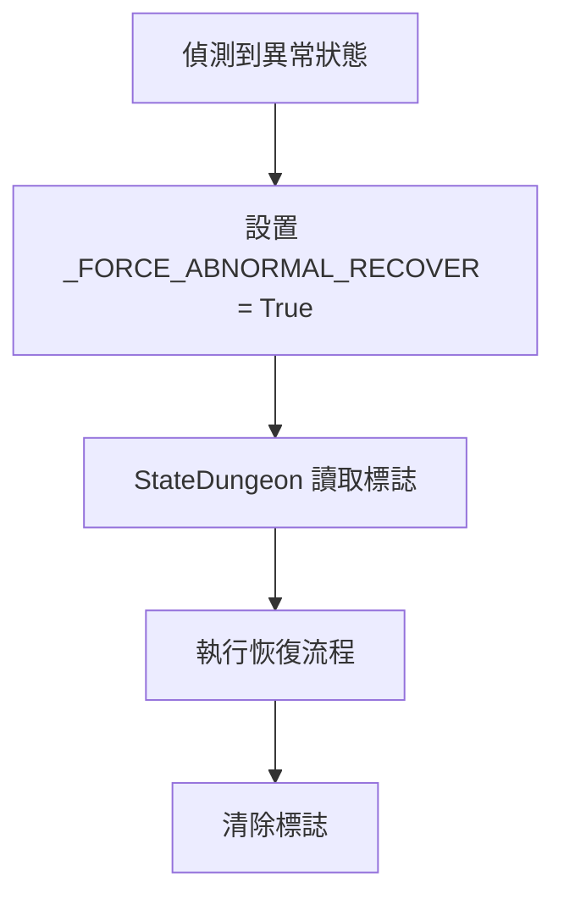
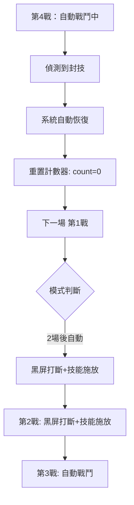

# 麻痺/封技恢復後重置戰鬥模式

## 背景

當角色在地城中中了麻痺或封技狀態時，系統會自動恢復。但恢復後，戰鬥計數器 (`_COMBAT_BATTLE_COUNT`) 不會被重置，導致下一場戰鬥仍被視為「已進行 N 場」，可能直接開啟自動戰鬥，而非按照設定執行黑屏打斷+技能施放。

**用戶期望**：恢復麻痺/封技後，下一場戰鬥應重新按照「自動戰鬥模式」設定執行。

---

## 目前架構分析

### 關鍵變數

| 變數 | 位置 | 說明 |
|------|------|------|
| `_COMBAT_BATTLE_COUNT` | RuntimeContext | 當前第幾戰 (1=首戰, 2=二戰...) |
| `_AOE_TRIGGERED_THIS_DUNGEON` | RuntimeContext | 本次地城是否已觸發自動戰鬥 |
| `_FORCE_ABNORMAL_RECOVER` | RuntimeContext | 強制異常狀態恢復標誌 |

### 異常檢測流程



### 問題點

目前在 `StateDungeon` 中恢復後只清除 `_FORCE_ABNORMAL_RECOVER`，但不會重置 `_COMBAT_BATTLE_COUNT`，因此下一場戰鬥仍以舊的場次計算。

---

## 提議的解決方案

### 方案說明

新增一個運行時標誌 `_RESET_BATTLE_COUNT_AFTER_RECOVER`，當偵測到**麻痺或封技**時設置此標誌。恢復完成後，重置戰鬥相關計數器。

### 為什麼只針對麻痺/封技？

- 麻痺/封技會導致角色無法行動，影響戰鬥節奏
- 恢復後希望重新執行技能施放策略（黑屏打斷+技能）
- 其他狀態（中毒/石化等）通常不影響技能施放

---

## 不同自動戰鬥模式的處理結果

當用戶設定不同的「自動戰鬥模式」時，麻痺/封技恢復後的行為如下：

| 模式 | 恢復後重置 `_COMBAT_BATTLE_COUNT` | 下一場戰鬥行為 |
|------|-----------------------------------|----------------|
| **完全自動** | `0` | 直接開啟自動戰鬥（`battle_count > 0` 即觸發） |
| **1 場後自動** | `0` | 第 1 戰：黑屏打斷 → 技能施放<br>第 2+ 戰：自動戰鬥 |
| **2 場後自動** | `0` | 第 1-2 戰：黑屏打斷 → 技能施放<br>第 3+ 戰：自動戰鬥 |
| **3 場後自動** | `0` | 第 1-3 戰：黑屏打斷 → 技能施放<br>第 4+ 戰：自動戰鬥 |
| **完全手動** | `0` | 永遠不開啟自動戰鬥，每場都等待用戶操作 |

### 情境範例

**情境**：用戶設定「2 場後自動」，目前已經打到第 4 戰（已開啟自動戰鬥）

1. **偵測到封技** → 系統自動恢復
2. **恢復完成** → 重置 `_COMBAT_BATTLE_COUNT = 0`，`_AOE_TRIGGERED_THIS_DUNGEON = False`
3. **下一場戰鬥（視為第 1 戰）**：
   - 觸發黑屏打斷
   - 執行角色技能配置中設定的技能
4. **再下一場（第 2 戰）**：繼續手動技能施放
5. **第 3 戰起**：自動開啟自動戰鬥



---

## Proposed Changes

### RuntimeContext 類別

#### [MODIFY] [script.py](file:///D:/Project/wvd/src/script.py)

新增運行時標誌：

```diff
 class RuntimeContext:
     ...
     _FORCE_ABNORMAL_RECOVER = False # 強制異常狀態恢復標誌
     _FORCE_LOWHP_RECOVER = False # 強制低血量恢復標誌
+    _RESET_BATTLE_COUNT_AFTER_RECOVER = False # 麻痺/封技恢復後重置戰鬥計數器標誌
     _IN_RESTART = False # 標記是否正在執行重啟流程
```

---

### CheckAbnormalStatus 函數 (偵測邏輯)

#### [MODIFY] [script.py](file:///D:/Project/wvd/src/script.py)

當偵測到麻痺或封技時，額外設置標誌。需要修改函數返回值或新增輸出參數。

**變更邏輯**：函數新增返回偵測到的狀態類型，讓調用者知道具體偵測到什麼狀態。

```python
def CheckAbnormalStatus(screenImage, setting):
    """檢查是否偵測到需要恢復的異常狀態
    
    Returns:
        tuple: (detected: bool, status_types: list)
            - detected: 是否偵測到任何異常狀態
            - status_types: 偵測到的狀態類型列表 (e.g., ['麻痺', '封技'])
    """
```

---

### 調用點修改

#### [MODIFY] [script.py](file:///D:/Project/wvd/src/script.py) (Line ~2323)

AUTO 對話處理中的調用：

```diff
-                            if CheckAbnormalStatus(scn_recover, setting):
-                                logger.info("[AUTO] 偵測到異常狀態，標記強制恢復")
-                                runtimeContext._FORCE_ABNORMAL_RECOVER = True
+                            detected, status_types = CheckAbnormalStatus(scn_recover, setting)
+                            if detected:
+                                logger.info(f"[AUTO] 偵測到異常狀態: {status_types}，標記強制恢復")
+                                runtimeContext._FORCE_ABNORMAL_RECOVER = True
+                                # 如果偵測到麻痺或封技，標記恢復後重置戰鬥計數
+                                if '麻痺' in status_types or '封技' in status_types:
+                                    runtimeContext._RESET_BATTLE_COUNT_AFTER_RECOVER = True
```

類似修改需應用於：
- Line ~2360 (AUTO-Timeout)
- Line ~5048 (StateChest)

---

### StateDungeon 恢復完成後處理

#### [MODIFY] [script.py](file:///D:/Project/wvd/src/script.py) (Line ~5252)

恢復完成後檢查並執行重置：

```diff
                                    shouldRecover = False
+                                   # 麻痺/封技恢復後重置戰鬥計數器
+                                   if runtimeContext._RESET_BATTLE_COUNT_AFTER_RECOVER:
+                                       logger.info("[恢復] 麻痺/封技恢復完成，重置戰鬥計數器以重新執行技能施放")
+                                       runtimeContext._COMBAT_BATTLE_COUNT = 0
+                                       runtimeContext._AOE_TRIGGERED_THIS_DUNGEON = False
+                                       runtimeContext._RESET_BATTLE_COUNT_AFTER_RECOVER = False
                                    break
```

---

## Verification Plan

### 自動化測試

1. 確認程式碼可正常編譯/執行無語法錯誤
2. 確認日誌正確輸出偵測到的狀態類型

### 手動驗證

1. **測試情境**：設定「1 場後自動」，進入地城
2. 在第 2+ 戰手動觸發麻痺/封技（需配合遊戲內容）
3. 觀察恢復完成後，下一場戰鬥是否：
   - 觸發黑屏打斷
   - 執行技能施放（非自動戰鬥）

---

## 風險評估

- **風險等級**: 低
- **影響範圍**: 僅影響麻痺/封技恢復後的戰鬥模式
- **回退方案**: 移除新增的標誌和相關邏輯

---

## 備註

> [!NOTE]
> 此功能需要用戶同時勾選「恢復麻痺」和/或「恢復封技」選項才會生效。
> 如果用戶未勾選這些選項，系統不會偵測這些狀態，自然也不會觸發重置。
