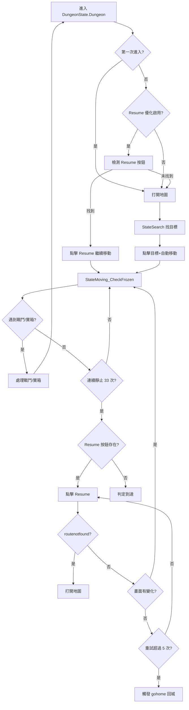

# Position/Harken Resume 優化分析

## 現狀分析

### 1. 目前 position/harken 的移動流程

### 2. 靜止判斷參數

| 參數 | 值 | 說明 |
|------|-----|------|
| `POLL_INTERVAL` | 0.3 秒 | 每次檢查間隔 |
| `STILL_REQUIRED` | 33 次 | 連續靜止次數 |
| **總等待時間** | **~10 秒** | 33 × 0.3 = 9.9 秒 |
| `mean_diff` 閾值 | 0.1 (10%) | 判定靜止的畫面變化閾值 |

### 3. gohome 觸發條件

| 觸發點 | 條件 | 說明 |
|--------|------|------|
| `StateMoving_CheckFrozen` | Resume 點擊 5 次後畫面仍靜止 | 第 2698 行 |
| `StateDungeon` (Resume 優化) | routenotfound + visibliityistoopoor | 第 3216-3218 行 |
| `StateDungeon` (Resume 優化) | 3 次 Resume 失敗 + 非樓梯目標 | 第 3283-3284 行 |
| `StateDungeon` (非 Resume) | 打開地圖 + visibliityistoopoor | 第 3315-3316 行，第 3345-3346 行 |
| 重啟後 | visibliityistoopoor | 第 3112-3117 行 |

---

## 你的需求理解

1. **除了第一次打開地圖外，之後都使用 Resume 按鈕**
   - ✅ 目前已經實現：`setting._ENABLE_RESUME_OPTIMIZATION` 開啟時會優先使用 Resume

2. **目的地到達判斷**：連續靜止判斷
   - 目前：33 次 × 0.3 秒 = ~10 秒
   - 你想要：可能可以調低（需要測試）
   - 風險：暴風雪地形可能誤判

3. **gohome 是否還需要**
   - 現在有 Resume 和 chest_auto，理論上不會卡在暴風雪內
   - gohome 主要是「最後手段」，當 Resume 多次失敗且非樓梯目標時觸發

---

## 討論點

### 1. 可以考慮簡化的部分

- [x] **移除 visibliityistoopoor 相關的 gohome 邏輯**：因為 Resume 和 chest_auto 已經可以避免卡住
- [x] **移除 StateMoving_CheckFrozen 中的 gohome 觸發**：改為直接打開地圖重新導航

### 2. 需要保留的部分

- [ ] **Resume 失敗 5 次後**：可能需要某種 fallback（但可能不是 gohome）
- [ ] **靜止判斷的閾值和次數**：33 次可以嘗試降低，但需要實測

### 3. 待測試

| 項目 | 目前值 | 建議測試值 | 風險 |
|------|--------|-----------|------|
| `STILL_REQUIRED` | 33 | 20 (~6秒) 或 15 (~4.5秒) | 暴風雪誤判 |
| `MOVING_TIMEOUT` | 60 秒 | 可保持 | 低 |
| `MAX_RESUME_RETRIES` | 5 | 可降低到 3 | 過早放棄 |

---

## 建議的簡化方案

### 方案 A：移除所有 gohome 邏輯

**優點**：
- 簡化代碼
- 不會意外回城

**缺點**：
- 如果真的卡住，沒有 fallback

**替代方案**：
- Resume 失敗 → 打開地圖重新導航
- 如果連續導航失敗 → restartGame()

### 方案 B：保留 gohome 但減少觸發

**修改**：
- 只在 `MOVING_TIMEOUT` 超時時觸發 gohome（而非 Resume 失敗）
- 提高 Resume 失敗後的容忍度

---

## 回覆你的問題

> **gohome是否還要？**

**建議**：可以移除，改用以下邏輯：
1. Resume 失敗 → 打開地圖重新導航
2. 連續導航失敗 N 次 → restartGame()

這樣更簡單，且不會意外回城中斷任務。

> **靜止判斷 33 次可以調低嗎？**

可以嘗試 **20 次（約 6 秒）**。但需要在暴風雪地形測試確認不會誤判。
