# StateChest 寶箱處理流程

## 流程圖

```mermaid
graph TD
    Start([進入 StateChest]) --> Init[初始化計數器和變數]
    Init --> MainLoop{主循環開始<br/>MAX=200}

    %% 停止信號檢查
    MainLoop --> StopCheck{停止信號?}
    StopCheck -- 是 --> ReturnNone([return None])

    %% 超時檢查
    StopCheck -- 否 --> TimeoutCheck{循環次數 > 200?}
    TimeoutCheck -- 是 --> ReturnNone

    %% 異常狀態檢查（每20次）
    TimeoutCheck -- 否 --> ModCheck20{循環 % 20 == 0?}
    ModCheck20 -- 是 --> AbnormalCheck{異常狀態?}
    AbnormalCheck -- 是 --> ReturnNone
    AbnormalCheck -- 否 --> ModCheck5
    ModCheck20 -- 否 --> ModCheck5

    %% 戰鬥/死亡檢查（每5次）
    ModCheck5{循環 % 5 == 0?}
    ModCheck5 -- 是 --> CombatCheck{combatActive?}
    CombatCheck -- 是 --> ReturnCombat([return Combat])
    CombatCheck -- 否 --> DeathCheck{RiseAgain?}
    DeathCheck -- 是 --> RiseAgainReset[RiseAgainReset] --> ReturnNone
    DeathCheck -- 否 --> DungFlagCheck
    ModCheck5 -- 否 --> DungFlagCheck

    %% dungFlag 連續確認（帶延遲重置）
    DungFlagCheck{dungFlag?}
    DungFlagCheck -- 是 --> DungFlagCount[連續計數+1<br/>重置失敗計數]
    DungFlagCount --> DungFlagConfirm{連續 >= 3?}
    DungFlagConfirm -- 是 --> ReturnDungeon([return Dungeon])
    DungFlagConfirm -- 否 --> ChestInteraction
    DungFlagCheck -- 否 --> FailCount[失敗計數+1]
    FailCount --> FailThreshold{失敗 >= 3?}
    FailThreshold -- 是 --> ResetCounts[重置所有計數] --> ChestInteraction
    FailThreshold -- 否 --> ChestInteraction

    %% 寶箱交互
    ChestInteraction[寶箱交互檢測]
    ChestInteraction --> WhoCheck{whowillopenit?}
    WhoCheck -- 是 --> SelectChar[選擇開箱角色<br/>檢查恐懼] --> HasInteraction[has_interaction = True]
    HasInteraction --> Continue([continue])

    WhoCheck -- 否 --> OpeningCheck{chestOpening?}
    OpeningCheck -- 是 --> PassThrough[pass - 等待開箱中]
    OpeningCheck -- 否 --> ChestFlagCheck{chestFlag?}
    ChestFlagCheck -- 是 --> ClickChest[點擊寶箱] --> HasInteraction2[has_interaction = True] --> Continue
    ChestFlagCheck -- 否 --> CheckHasInteraction
    PassThrough --> CheckHasInteraction

    CheckHasInteraction{has_interaction?}
    CheckHasInteraction -- 是 --> Continue
    CheckHasInteraction -- 否 --> SpamClick

    %% 默認操作：Spam Click
    SpamClick[默認操作區]
    SpamClick --> ModCheck2{循環 % 2 == 0?}
    ModCheck2 -- 是 --> FastForward{快進關閉?}
    FastForward -- 是 --> PressFF[點擊開啟快進] --> Continue
    FastForward -- 否 --> RetryCheck{網路重試?}
    RetryCheck -- 是 --> PressRetry[點擊重試] --> Continue
    RetryCheck -- 否 --> BlackScreen
    ModCheck2 -- 否 --> BlackScreen

    %% 黑幕檢測
    BlackScreen{亮度 < 30?}
    BlackScreen -- 是 --> ReturnCombat2([return Combat])
    BlackScreen -- 否 --> BurstClick

    %% Burst Click
    BurstClick[Burst Click<br/>3次 x 0.05s]
    BurstClick --> MainLoop

    style AbnormalCheck fill:#fff0f0
    style CombatCheck fill:#fff0f0
    style DeathCheck fill:#fff0f0
    style DungFlagCheck fill:#f0fff0
    style WhoCheck fill:#f0f0ff
    style OpeningCheck fill:#f0f0ff
    style BurstClick fill:#ffffd0
    style BlackScreen fill:#ffcccc
```



---

## 檢查優先級順序

| 優先級 | 檢查項目 | 頻率 | 動作 |
|--------|----------|------|------|
| 1 | 停止信號 `_FORCESTOPING` | 每次 | return None |
| 2 | 超時 (> 200 次循環) | 每次 | return None |
| 3 | 異常狀態 (ambush/因果/下載等) | 每 20 次 | return None |
| 4 | 戰鬥 `combatActive` | 每 5 次 | return Combat |
| 5 | 死亡 `RiseAgain` | 每 5 次 | RiseAgainReset → return None |
| 6 | `dungFlag` (需連續 3 次) | 每次 | return Dungeon |
| 7 | 寶箱交互 | 每次 | 處理後 continue |
| 8 | 快進 / 網路重試 | 每 2 次 | 點擊後 continue |
| 9 | 黑幕檢測 | 每次 | return Combat |
| 10 | Burst Click (3次) | 每次 | 連點後回主循環 |

---

## 寶箱狀態處理

### whowillopenit（選擇開箱人）
1. 讀取 `_WHOWILLOPENIT` 設定
2. 檢查角色是否有恐懼 (`chestfear`)
3. 若有恐懼 → 移除該角色，重選
4. 點擊選定角色
5. 設置 `has_interaction = True` → continue

### chestOpening（開箱動畫）
- 檢測到時直接 pass（等待動畫）
- 不設置 `has_interaction`，繼續往下執行

### chestFlag（點擊寶箱）
- 點擊 `chestFlag` 位置
- 設置 `has_interaction = True` → continue

### 無任何寶箱狀態
- 進入 Spam Click 區塊
- 執行快進/重試檢查
- 執行 Burst Click

---

## dungFlag 延遲重置機制

```
偵測到 dungFlag:
    ├── 連續計數 +1
    ├── 重置失敗計數
    └── 連續 >= 3 → return Dungeon

未偵測到 dungFlag:
    ├── 失敗計數 +1
    └── 失敗 >= 3 → 重置連續計數和失敗計數
```

**目的**: 防止因短暫遮擋（如彈窗）導致 dungFlag 計數被過早重置

---

## Burst Click 連點機制

```python
# 每次主循環末尾執行
for _ in range(3):
    Press(disarm)  # [515, 934]
    Sleep(0.05)
```

**特點**:
- 3 次快速連點
- 間隔 0.05 秒
- 總耗時約 0.15 秒
- 用於快速消除對話框和彈窗

---

## 黑幕檢測

```python
screen_brightness = scn.mean()
if screen_brightness < 30:
    return DungeonState.Combat
```

**目的**: 偵測可能正在進入戰鬥的黑屏過場，提前返回戰鬥狀態

---

## 關鍵變數

| 變數 | 類型 | 說明 |
|------|------|------|
| `MAX_CHEST_WAIT_LOOPS` | int | 主循環最大次數 (200) |
| `DUNGFLAG_CONFIRM_REQUIRED` | int | dungFlag 連續確認次數 (3) |
| `DUNGFLAG_FAIL_THRESHOLD` | int | 允許的連續失敗次數 (3) |
| `disarm` | list | 解除陷阱/點擊座標 `[515, 934]` |
| `availableChar` | list | 可用角色列表 `[0,1,2,3,4,5]` |
| `has_interaction` | bool | 本次循環是否有寶箱交互 |

---

## 分頻檢查策略

| 檢查項目 | 頻率 | 原因 |
|----------|------|------|
| 異常狀態 | 每 20 次 | 發生頻率低，減少 CPU 開銷 |
| 戰鬥/死亡 | 每 5 次 | 中等優先級，約 0.5~1 秒檢查一次 |
| 快進/重試 | 每 2 次 | 較常需要處理 |
| dungFlag/寶箱交互/Burst Click | 每次 | 核心邏輯，必須即時響應 |

---

## 異常狀態列表

```python
abnormal_states = [
    'ambush', 'ignore', 'sandman_recover', 'cursedWheel_timeLeap',
    'multipeopledead', 'startdownload', 'totitle', 'Deepsnow',
    'adventurersbones', 'halfBone', 'nothanks', 'strange_things',
    'blessing', 'DontBuyIt', 'donthelp', 'buyNothing', 'Nope',
    'ignorethequest', 'dontGiveAntitoxin', 'pass', 'returnText', 'ReturnText'
]
```
