# StateChest 寶箱處理流程

## 流程圖

```mermaid
graph TD
    Start([進入 StateChest]) --> Init[初始化計數器和變數]
    Init --> MainLoop{主循環開始}

    %% 停止信號檢查
    MainLoop --> StopCheck{停止信號?}
    StopCheck -- 是 --> ReturnNone([return None])
    
    %% 異常狀態檢查（最優先）
    StopCheck -- 否 --> AbnormalCheck{異常狀態?<br/>ambush/伏擊/下載/因果等}
    AbnormalCheck -- 是 --> ReturnNone
    
    %% 戰鬥檢查
    AbnormalCheck -- 否 --> CombatCheck{combatActive?}
    CombatCheck -- 是 --> ReturnCombat([return Combat])
    
    %% 死亡檢查
    CombatCheck -- 否 --> DeathCheck{RiseAgain?}
    DeathCheck -- 是 --> RiseAgainReset[RiseAgainReset] --> ReturnNone
    
    %% dungFlag 連續確認
    DeathCheck -- 否 --> DungFlagCheck{dungFlag?}
    DungFlagCheck -- 是 --> DungFlagCount[連續計數+1]
    DungFlagCount --> DungFlagConfirm{連續>=3次?}
    DungFlagConfirm -- 是 --> ReturnDungeon([return Dungeon])
    DungFlagConfirm -- 否 --> Sleep02[Sleep 0.2] --> MainLoop
    DungFlagCheck -- 否 --> ResetDungCount[重置 dungFlag 計數]
    
    %% 寶箱狀態檢測
    ResetDungCount --> ChestStateCheck[檢測寶箱狀態<br/>whowillopenit/chestOpening/chestFlag]
    
    %% 快進和網路重試
    ChestStateCheck --> FastForward{快進關閉?}
    FastForward -- 是 --> PressFF[點擊開啟快進] --> MainLoop
    FastForward -- 否 --> RetryCheck{網路重試?}
    RetryCheck -- 是 --> PressRetry[點擊重試] --> MainLoop
    
    %% 只有 chestFlag（有 continue）
    RetryCheck -- 否 --> OnlyChestFlag{只有 chestFlag?<br/>無 whowillopenit 和 chestOpening}
    OnlyChestFlag -- 是 --> ClickChestFlag[點擊 chestFlag] --> MainLoop
    
    %% 沒有任何寶箱狀態（有 continue）
    OnlyChestFlag -- 否 --> NoChestState{無任何寶箱狀態?}
    NoChestState -- 是 --> ClickBlank[點擊空白處]
    ClickBlank --> TimeoutCheck{達到100次上限?}
    TimeoutCheck -- 是 --> Break([退出循環])
    TimeoutCheck -- 否 --> MainLoop
    
    %% whowillopenit 處理（無 continue，繼續往下）
    NoChestState -- 否 --> WhoCheck{whowillopenit?}
    WhoCheck -- 是 --> SelectChar[選擇開箱角色]
    SelectChar --> FearCheck{該角色有恐懼?}
    FearCheck -- 是 --> RemoveChar[移除重選] --> SelectChar
    FearCheck -- 否 --> ClickChar[點擊選定角色]
    ClickChar --> SmartDisarm1{SmartDisarm?}
    SmartDisarm1 -- 否 --> Disarm8[disarm 8次] --> OpeningCheck
    SmartDisarm1 -- 是 --> OpeningCheck
    
    %% chestOpening 處理（無 continue，繼續往下）
    WhoCheck -- 否 --> OpeningCheck{chestOpening?}
    OpeningCheck -- 是 --> SmartDisarm2{SmartDisarm?}
    SmartDisarm2 -- 是 --> ChestOpen[調用 ChestOpen] --> DialogLoop
    SmartDisarm2 -- 否 --> DialogLoop
    
    %% 開箱對話快速點擊循環
    DialogLoop{對話循環 MAX=50}
    DialogLoop --> DL_Combat{戰鬥?}
    DL_Combat -- 是 --> LoopEnd
    DL_Combat -- 否 --> DL_Death{死亡?}
    DL_Death -- 是 --> LoopEnd
    DL_Death -- 否 --> DL_NewChest{新寶箱?}
    DL_NewChest -- 是 --> LoopEnd
    DL_NewChest -- 否 --> DL_DungFlag{dungFlag?}
    DL_DungFlag -- 是 --> DL_DungCount[連續計數+1]
    DL_DungCount --> DL_DungConfirm{連續>=3?}
    DL_DungConfirm -- 是 --> ReturnDungeon
    DL_DungConfirm -- 否 --> DialogLoop
    DL_DungFlag -- 否 --> DL_Click[連點3下] --> DialogLoop
    
    %% 循環結束後的額外檢查
    OpeningCheck -- 否 --> LoopEnd[循環末尾額外檢查]
    LoopEnd --> EndRiseAgain{RiseAgain?}
    EndRiseAgain -- 是 --> RiseAgainReset2[RiseAgainReset] --> ReturnNone2([return None])
    EndRiseAgain -- 否 --> EndDungFlag{dungFlag?}
    EndDungFlag -- 是 --> ReturnDungeon2([return Dungeon])
    EndDungFlag -- 否 --> EndCombat{combatActive?}
    EndCombat -- 是 --> ReturnCombat2([return Combat])
    EndCombat -- 否 --> TryRetry[TryPressRetry] --> MainLoop

    style AbnormalCheck fill:#fff0f0
    style CombatCheck fill:#fff0f0
    style DeathCheck fill:#fff0f0
    style DungFlagCheck fill:#f0fff0
    style WhoCheck fill:#f0f0ff
    style OpeningCheck fill:#f0f0ff
    style LoopEnd fill:#ffffd0
```



---

## 檢查優先級順序

| 優先級 | 檢查項目 | 動作 |
|--------|----------|------|
| 1 | 停止信號 `_FORCESTOPING` | return None |
| 2 | 異常狀態 (ambush/因果/下載等) | return None |
| 3 | 戰鬥 `combatActive` | return Combat |
| 4 | 死亡 `RiseAgain` | RiseAgainReset → return None |
| 5 | `dungFlag` (需連續 3 次) | return Dungeon |
| 6 | 快進關閉 / 網路重試 | 點擊後 continue |
| 7 | 寶箱狀態處理 | 見下方詳細流程 |

---

## 寶箱狀態處理

### 只有 chestFlag
點擊 `chestFlag` 開始開箱流程 → 回到主循環

### whowillopenit（選擇開箱人）
1. 讀取 `_WHOWILLOPENIT` 設定
2. 檢查角色是否有恐懼 (`chestfear`)
3. 若有恐懼 → 移除該角色，重選
4. 點擊選定角色
5. 若未啟用 SmartDisarm → 點擊 `disarm` 8 次

### chestOpening（開箱動畫）
1. 若啟用 SmartDisarm → 調用 `ChestOpen()`
2. 進入快速點擊循環 (MAX_DIALOG_CLICKS = 50)
3. 每次循環檢查：戰鬥/死亡/新寶箱/dungFlag
4. dungFlag 需連續 3 次確認才返回

### 無任何寶箱狀態
點擊空白處 `[1,1]` 嘗試跳過對話
- 達到 100 次上限 → 退出循環

---

## 關鍵變數

| 變數 | 類型 | 說明 |
|------|------|------|
| `MAX_CHEST_WAIT_LOOPS` | int | 主循環最大次數 (100) |
| `DUNGFLAG_CONFIRM_REQUIRED` | int | dungFlag 連續確認次數 (3) |
| `MAX_DIALOG_CLICKS` | int | 對話循環最大點擊次數 (50) |
| `disarm` | list | 解除陷阱按鈕座標 `[515, 934]` |
| `availableChar` | list | 可用角色列表 `[0,1,2,3,4,5]` |

---

## 異常狀態列表

```python
abnormal_states = [
    'ambush', 'ignore', 'sandman_recover', 'cursedWheel_timeLeap',
    'multipeopledead', 'startdownload', 'totitle', 'Deepsnow',
    'adventurersbones', 'halfBone', 'nothanks', 'strange_things', 
    'blessing', 'DontBuyIt', 'donthelp', 'buyNothing', 'Nope', 
    'ignorethequest', 'dontGiveAntitoxin', 'pass'
]
```
